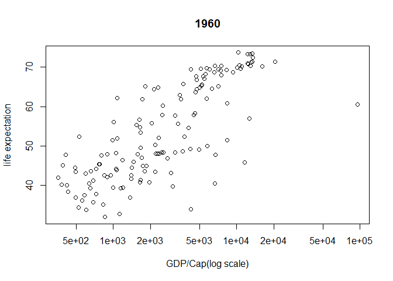
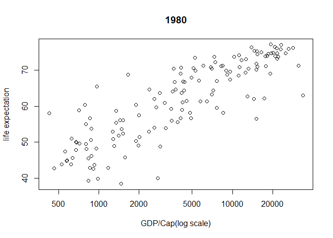
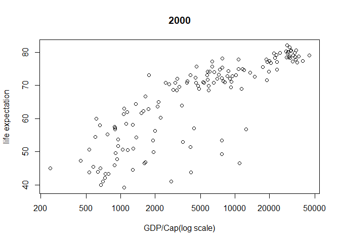

hw01\_gapminder
================
Yeonuk
September 15, 2017

1. Load Gapminder
=================

``` r
library(gapminder)
head(gapminder)
```

    ##       country continent year lifeExp      pop gdpPercap
    ## 1 Afghanistan      Asia 1952  28.801  8425333  779.4453
    ## 2 Afghanistan      Asia 1957  30.332  9240934  820.8530
    ## 3 Afghanistan      Asia 1962  31.997 10267083  853.1007
    ## 4 Afghanistan      Asia 1967  34.020 11537966  836.1971
    ## 5 Afghanistan      Asia 1972  36.088 13079460  739.9811
    ## 6 Afghanistan      Asia 1977  38.438 14880372  786.1134

``` r
summary(gapminder)
```

    ##         country        continent        year         lifeExp     
    ##  Afghanistan:  12   Africa  :624   Min.   :1952   Min.   :23.60  
    ##  Albania    :  12   Americas:300   1st Qu.:1966   1st Qu.:48.20  
    ##  Algeria    :  12   Asia    :396   Median :1980   Median :60.71  
    ##  Angola     :  12   Europe  :360   Mean   :1980   Mean   :59.47  
    ##  Argentina  :  12   Oceania : 24   3rd Qu.:1993   3rd Qu.:70.85  
    ##  Australia  :  12                  Max.   :2007   Max.   :82.60  
    ##  (Other)    :1632                                                
    ##       pop              gdpPercap       
    ##  Min.   :6.001e+04   Min.   :   241.2  
    ##  1st Qu.:2.794e+06   1st Qu.:  1202.1  
    ##  Median :7.024e+06   Median :  3531.8  
    ##  Mean   :2.960e+07   Mean   :  7215.3  
    ##  3rd Qu.:1.959e+07   3rd Qu.:  9325.5  
    ##  Max.   :1.319e+09   Max.   :113523.1  
    ## 

2. Drawing figure (life Exp-GDP/cap)
====================================

``` r
plot(lifeExp ~ gdpPercap, gapminder, subset = year == 1962, log = "x", xlab="GDP/Cap(log scale)", ylab= "life expectation", main="1960")
```



``` r
plot(lifeExp ~ gdpPercap, gapminder, subset = year == 1982, log = "x", xlab="GDP/Cap(log scale)", ylab= "life expectation", main="1980")
```



``` r
plot(lifeExp ~ gdpPercap, gapminder, subset = year == 2002, log = "x", xlab="GDP/Cap(log scale)", ylab= "life expectation", main="2000")
```


