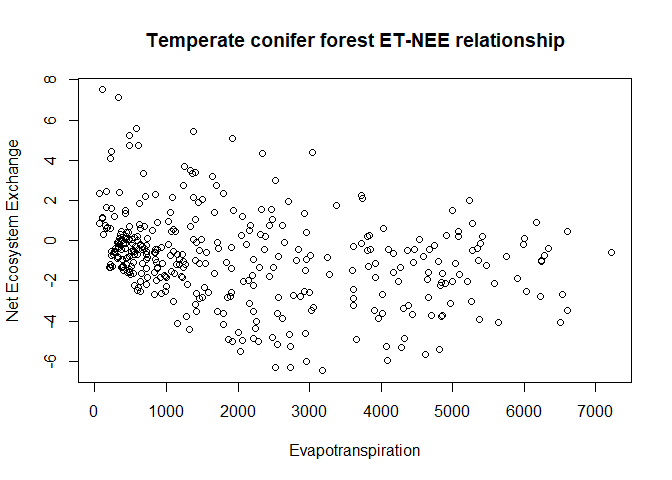

trial2
================
Yeonuk
September 15, 2017

``` r
data1<-read.table("2010_GCK.txt", header=T)
plot(data1$LE,data1$NEE,xlab="Evapotranspiration",ylab="Net Ecosystem Exchange",main="Temperate conifer forest ET-NEE relationship")
```


